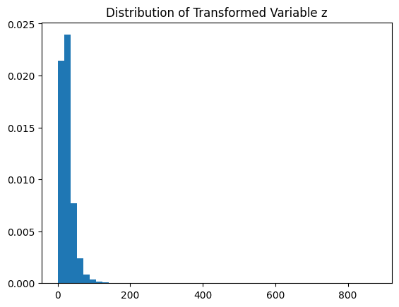
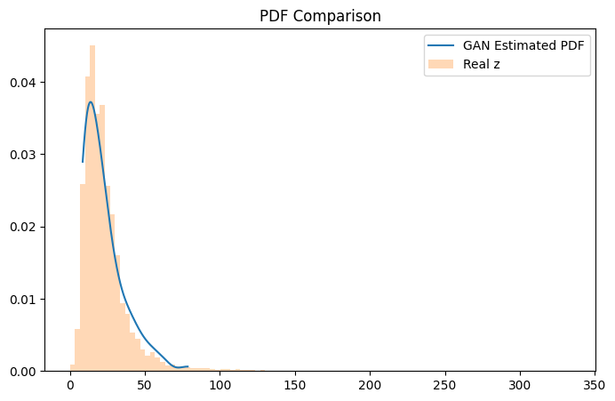
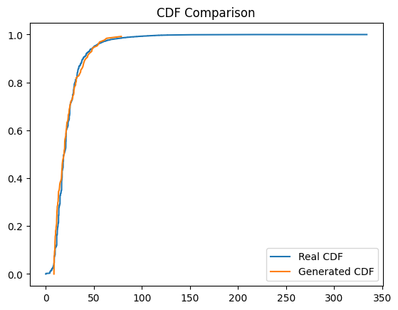
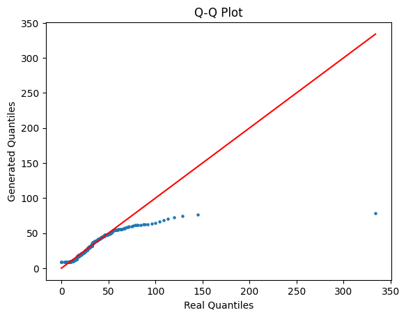
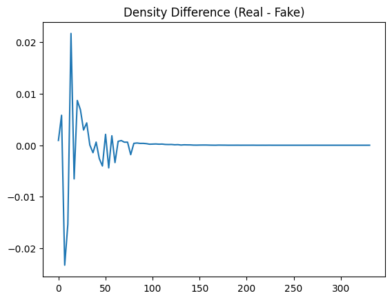

# PDF Estimation using GAN on Transformed NO₂ Data

## Project Overview

This project demonstrates implicit probability density estimation using
a Generative Adversarial Network (GAN).

Instead of assuming a parametric distribution (e.g., Gaussian), we learn
the probability density function directly from transformed environmental
data.

The pipeline includes: - Data preprocessing - Nonlinear transformation -
GAN-based distribution learning - Sample generation - Density estimation
using KDE - Quantitative evaluation

------------------------------------------------------------------------

## Dataset

Location: data/data.csv

Feature used: NO₂ concentration (no2)

Preprocessing steps: - Removed missing values - Converted to numeric -
Dropped invalid entries

------------------------------------------------------------------------

## Nonlinear Transformation

Each value x is transformed to:

z = x + a_r \* sin(b_r \* x)

Where: a_r = 0.5 \* (r mod 7) b_r = 0.3 \* ((r mod 5) + 1)

r = 102303599

This introduces controlled nonlinearity and alters the distribution
shape.

------------------------------------------------------------------------

## GAN Architecture

Generator: - Linear(1 → 32) - ReLU - Linear(32 → 64) - ReLU - Linear(64
→ 1)

Discriminator: - Linear(1 → 128) - LeakyReLU(0.2) - Linear(128 → 128) -
LeakyReLU(0.2) - Linear(128 → 64) - LeakyReLU(0.2) - Linear(64 → 1) -
Sigmoid

Loss: Binary Cross Entropy\
Optimizer: Adam\
Learning Rate: 5e-5

------------------------------------------------------------------------

## Training Strategy

The generator maps Gaussian noise to synthetic samples.

The discriminator distinguishes between: - Real transformed samples -
Generated samples

Training continues until discriminator confidence approaches 0.5,
indicating equilibrium.

------------------------------------------------------------------------

## Outputs

## Distribution After Transformation

## GAN Estimated Density

## CDF Comparison

## Q-Q Plot

## Density Difference

## Quantitative Evaluation

Wasserstein Distance computed to measure similarity between real and
generated distributions.

Lower values indicate closer distribution alignment.

------------------------------------------------------------------------

## Project Structure

PDF-GAN/ │ ├── data/ │ └── data.csv │ ├── plots/ │ ├──
distribution_z.png │ ├── Gan_estimated.png │ ├── cdf_comparison.png │
├── quantile_plot.png │ └── density_difference.png │ ├── src/ │ └──
main.ipynb │ ├── requirements.txt └── README.md

------------------------------------------------------------------------

## Conclusion

This project demonstrates that GANs can implicitly learn complex
probability density functions without assuming any parametric form.

The trained generator approximates the transformed distribution and
captures the dominant density structure.
