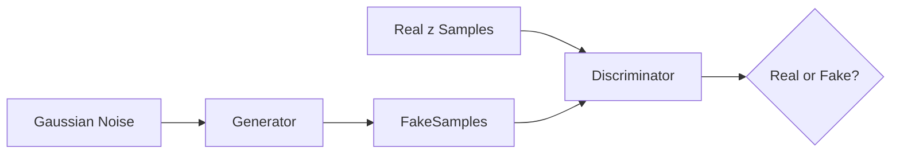

# Learning Probability Density Function using GAN

## Implicit Density Modeling of Transformed NO₂ Data

------------------------------------------------------------------------

## 1. Project Objective

This project aims to learn the probability density function (PDF) of a
transformed environmental variable using a Generative Adversarial
Network (GAN).

Instead of assuming a parametric distribution (Gaussian, exponential,
etc.), the model learns the distribution directly from data samples.

------------------------------------------------------------------------

## 2. Dataset and Preprocessing

Feature used: **NO₂ concentration (`no2`)**

### Preprocessing Steps

1.  Loaded dataset using pandas.
2.  Removed missing values.
3.  Converted values to numeric format.
4.  Dropped invalid entries.
5.  Standardized transformed data for GAN stability.

After cleaning:

x = {x₁, x₂, ..., xₙ}

Preprocessing ensures stable GAN training and meaningful density
estimation.

------------------------------------------------------------------------

## 3. Nonlinear Transformation

Each value is transformed using:

z = x + a_r sin(b_r x)

Where:

a_r = 0.5 (r mod 7)\
b_r = 0.3 ((r mod 5) + 1)

This transformation introduces controlled nonlinearity and modifies the
distribution shape.

------------------------------------------------------------------------

## 4. GAN Architecture

### Generator

-   Linear (1 → 32)
-   ReLU
-   Linear (32 → 64)
-   ReLU
-   Linear (64 → 1)

### Discriminator

-   Linear (1 → 128)
-   LeakyReLU(0.2)
-   Linear (128 → 128)
-   LeakyReLU(0.2)
-   Linear (128 → 64)
-   LeakyReLU(0.2)
-   Linear (64 → 1)
-   Sigmoid

Loss: Binary Cross Entropy\
Optimizer: Adam\
Learning Rate: 5e-5

------------------------------------------------------------------------

## GAN Training Flow

------------------------------------------------------------------------

## 5. Training Strategy

The generator maps Gaussian noise to synthetic samples.

The discriminator distinguishes between: - Real transformed samples -
Generated samples

Training continues until discriminator confidence approaches 0.5,
indicating equilibrium.

------------------------------------------------------------------------

## 6. Density Estimation

After training: - 200,000 synthetic samples generated - Kernel Density
Estimation (KDE) applied - Real vs Generated distributions compared

------------------------------------------------------------------------

## 7. Visual Outputs

Ensure the following images are stored in the `plots/` folder:

-   plots/distribution_z.png
-   plots/Gan_estimated.png
-   plots/cdf_comparison.png
-   plots/quantile_plot.png
-   plots/density_difference.png

Example embedding:

------------------------------------------------------------------------

## 8. Quantitative Evaluation

Wasserstein Distance used to measure similarity between real and
generated distributions.

Lower values indicate better alignment.

------------------------------------------------------------------------

## 9. Project Structure
PDF-GAN
 ├── data
 │    └── data.csv
 ├── plots
 │    ├── distribution_z.png
 │    ├── Gan_estimated.png
 │    ├── cdf_comparison.png
 │    ├── quantile_plot.png
 │    └── density_difference.png
 ├── src
 │    └── main.ipynb
 ├── README.md
 └── requirements.txt
------------------------------------------------------------------------

## Conclusion

This project demonstrates implicit probability density estimation using
GANs without assuming any parametric form.

The trained generator approximates the transformed distribution and
captures the dominant density structure.
